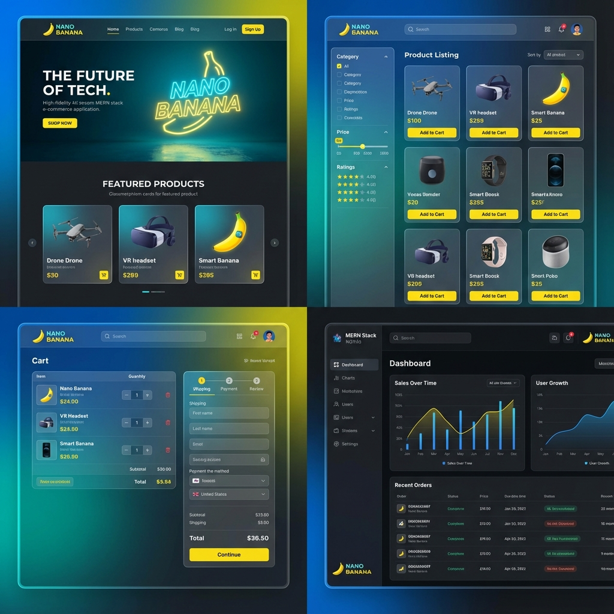

<div align="center">

# 🛒 MERN Shopping App
### A High-Performance, Full-Stack E-Commerce Solution


<p align="center">
  
  
  
  
  
  
  
</p>

</div>

---

## 📸 Project Preview

> **🚧 Screenshot Placeholder**
>
> *Add your application screenshots here. Showcase the Landing Page, Product Details, Cart, and Admin Dashboard.*

<div align="center">
  
</div>

---

## 🚀 Key Features

### 🛍️ User Experience
*   **Browse & Search:** Advanced product filtering, searching, and categorization.
*   **Seamless Cart:** Add to cart, update quantities, and calculate totals dynamically.
*   **Secure Checkout:** Integrated payment simulation and order validation.
*   **User Profiles:** Manage address book, view order history, and track status.
*   **Responsive Design:** Fully optimized for Mobile, Tablet, and Desktop.

### 🛡️ Admin Power
*   **Dashboard Analytics:** Visual overview of sales, users, and orders.
*   **Product Management:** Create, edit, delete, and manage inventory stock.
*   **Order Fulfillment:** Track order status (Pending → Shipped → Delivered).
*   **Real-Time Sync:** **Socket.IO** integration for instant stock updates across clients.
*   **Global Settings:** Update site name, currency, and SEO meta tags instantly.

---

## 🧠 Tech Stack

| Layer | Technology | Description |
| :--- | :--- | :--- |
| **Frontend** |   | React.js, Tailwind CSS, Framer Motion, Axios, Redux Toolkit |
| **Backend** |   | Node.js, Express.js, RESTful APIs |
| **Database** |  | MongoDB (Atlas), Mongoose ODM |
| **Auth** |  | JSON Web Tokens, Role-Based Access Control (RBAC) |
| **Real-Time** |  | WebSockets for Inventory & Settings Sync |
| **Deploy** |   | Frontend on Netlify/Vercel, Backend on Render |

---

## 🏗️ Folder Structure

```bash
root/
├── backend/                # Node.js + Express API
│   ├── src/
│   │   ├── config/         # DB Connection & Configs
│   │   ├── controllers/    # Route Logic
│   │   ├── models/         # Mongoose Schemas (User, Product, Order)
│   │   ├── routes/         # API Routes
│   │   ├── middleware/     # Auth & Error Handlers
│   │   └── utils/          # Helper Functions
│   └── server.js           # Entry Point
│
└── frontend/               # React + Tailwind App
    ├── src/
    │   ├── admin/          # Admin Panel Components & Pages
    │   ├── assets/         # Images & Icons
    │   ├── components/     # Reusable UI Components
    │   ├── context/        # React Context (Settings)
    │   ├── pages/          # User views (Home, Cart, Profile)
    │   ├── redux/          # State Management
    │   └── services/       # API Axios Instances
    └── main.jsx            # React Entry
```

---

## ⚙️ Installation & Setup

Follow these steps to set up the project locally.

### 1️⃣ Clone the Repository

```bash
git clone https://github.com/yourusername/mern-shopping-app.git
cd mern-shopping-app
```

### 2️⃣ Backend Setup

```bash
cd backend
npm install        # Install backend dependencies
```

**Create a `.env` file in the `backend` folder:**

```env
PORT=5000
MONGO_URI=your_mongodb_connection_string
JWT_ACCESS_SECRET=your_jwt_secret
JWT_REFRESH_SECRET=your_refresh_secret
NODE_ENV=development
```

**Start the Server:**

```bash
npm run dev
```

### 3️⃣ Frontend Setup

```bash
cd ../frontend
npm install        # Install frontend dependencies
npm run dev        # Start React Dev Server
```

> The App should now be running on `http://localhost:5173` (Frontend) and `http://localhost:5000` (Backend).

---

## 🧑‍💻 Admin Panel Access

The application includes a comprehensive Admin Dashboard.

1.  **Register a new user.**
2.  **Manually update the user role** in MongoDB to `admin`.
    *   Find the user document.
    *   Set `"role": "admin"`.
3.  **Log in** and access the dashboard via the Profile menu.

**Key Admin Features:**
*   Manage **Items & Stock** instantly.
*   View **Live Orders** coming in.
*   Update **Global Website Settings** (Logos, Title, Tax).
*   Analyze **Sales Performance**.

---

## 🌍 Deployment

*   **Frontend:** Deployed on **Netlify** / **Vercel**.
    *   Build command: `npm run build`
    *   Output directory: `dist`
*   **Backend:** Deployed on **Render** / **Railway**.
    *   Connect your repo and set build command to `npm install`.
    *   Start command: `node src/server.js`

---

## 📈 Future Enhancements

*   [ ] **Payment Gateway Integration** (Stripe/Razorpay)
*   [ ] **Wishlist Functionality** for saving favorites
*   [ ] **Product Reviews & Ratings** system
*   [ ] **Email Notifications** for order updates
*   [ ] **PWA Support** for mobile-app-like experience

---

## 🤝 Contributing

Contributions are welcome!

1.  Fork the Project
2.  Create your Feature Branch (`git checkout -b feature/AmazingFeature`)
3.  Commit your Changes (`git commit -m 'Add some AmazingFeature'`)
4.  Push to the Branch (`git push origin feature/AmazingFeature`)
5.  Open a Pull Request

---

## 📜 License

This project is licensed under the **MIT License**.

---

<div align="center">

### 👨‍💻 Developed by [Your Name]

[](https://github.com/yourusername)
[](https://linkedin.com/in/yourusername)
[](https://yourportfolio.com)

</div>
